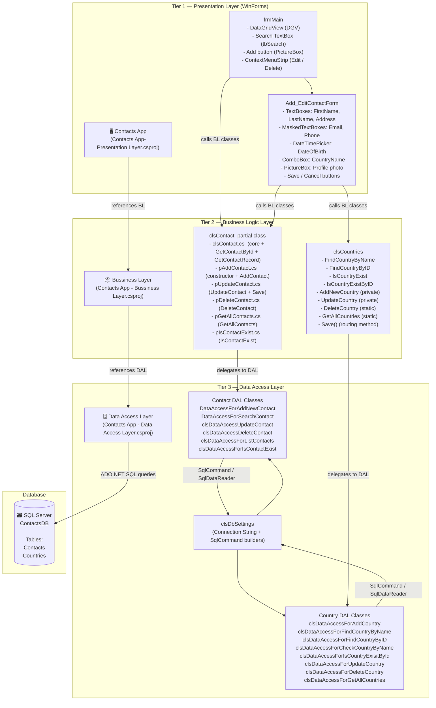

# Contacts App Project Documentation


https://github.com/user-attachments/assets/082777cf-7b7f-4930-8348-e829dbae9897

---

## Table of Contents

1. [Project Overview](#1-project-overview)
2. [Technology Stack](#2-technology-stack)
3. [Three-Tier Architecture](#3-three-tier-architecture)
   - 3.1 [Architecture Diagram](#31-architecture-diagram)
   - 3.2 [Layer Responsibilities](#32-layer-responsibilities)
   - 3.3 [Dependency Flow](#33-dependency-flow)
4. [Project Structure & File Organization](#4-project-structure--file-organization)
   - 4.1 [Presentation Layer](#41-presentation-layer-contacts-app)
   - 4.2 [Business Logic Layer](#42-business-logic-layer-bussiness-layer)
   - 4.3 [Data Access Layer](#43-data-access-layer-data-access-layer)
5. [Features](#5-features)
   - 5.1 [Contact Management Features](#51-contact-management-features)
6. [Class Reference](#6-class-reference)
   - 6.1 [Business Logic Classes](#61-business-logic-classes)
   - 6.2 [Data Access Classes](#62-data-access-classes)
   - 6.3 [Presentation Classes (Forms)](#63-presentation-classes-forms)
7. [Validation & Business Rules](#7-validation--business-rules)
   - 7.1 [Business Layer Validations](#71-business-layer-validations)
   - 7.2 [Data Access Layer Validations](#72-data-access-layer-validations)
   - 7.3 [Presentation Layer Input Handling](#73-presentation-layer-input-handling)
8. [Database Design](#8-database-design)
9. [Key Design Patterns & Decisions](#9-key-design-patterns--decisions)
10. [Data Flow Walkthroughs](#10-data-flow-walkthroughs)
    - 10.1 [Adding a New Contact](#101-adding-a-new-contact)
    - 10.2 [Updating an Existing Contact](#102-updating-an-existing-contact)
    - 10.3 [Searching a Contact by ID](#103-searching-a-contact-by-id)
    - 10.4 [Deleting a Contact](#104-deleting-a-contact)

---

## 1. Project Overview

The **Contacts App** is a C# **Windows Forms** desktop application designed to manage a contact book backed by a **SQL Server** database. It allows users to create, read, update, and delete (CRUD) **Contacts** through a graphical user interface.

The application is architecturally split into **three separate C# projects**, each representing one tier of the classic **3-Tier Architecture** pattern:

| Project | Role |
|---|---|
| `Contacts App` | Presentation Layer (WinForms UI) |
| `Contacts App - Bussiness Layer` | Business Logic Layer |
| `Contacts App - Data Access Layer` | Data Access Layer |

The three projects are assembled into a single Visual Studio solution (`Contacts App.slnx`).

---

## 2. Technology Stack

| Component | Technology |
|---|---|
| **Language** | C# (.NET) |
| **Application Type** | Windows Forms Desktop Application |
| **Database** | Microsoft SQL Server (`ContactsDB`) |
| **Data Access** | ADO.NET (`Microsoft.Data.SqlClient`) |
| **ORM** | None — raw parameterized SQL queries |
| **IDE** | Visual Studio |
| **Architecture Pattern** | 3-Tier Architecture |

---

## 3. Three-Tier Architecture

### 3.1 Architecture Diagram



> [!NOTE]
> **Strict one-way dependency rule**: The Presentation Layer only knows about the Business Logic Layer. The Business Logic Layer only knows about the Data Access Layer. The DAL knows only about the database. No layer references a layer above it.

---

### 3.2 Layer Responsibilities

#### Tier 1 — Presentation Layer (WinForms)
- Renders a graphical user interface using Windows Forms controls (forms, grids, text boxes, combo boxes, etc.).
- Reads user input from WinForms controls and validates it using `ErrorProvider` and control-level `Validating` events.
- Calls Business Logic Layer classes to execute operations (search, add, update, delete).
- Displays results in a `DataGridView` and provides feedback via `MessageBox` dialogs.
- Supports photo upload/removal for contacts via `OpenFileDialog`.
- Contains **zero business logic** and **zero SQL queries**.

#### Tier 2 — Business Logic Layer
- Encapsulates the domain objects: `clsContact` and `clsCountries`.
- Implements the **mode-switching pattern** (`enMode.Add` / `enMode.Update`) via a `Save()` method that routes to the correct add or update operation.
- Enforces business-level validations (null checks, data guard clauses) before delegating to the DAL.
- Returns typed objects (e.g., `clsContact?`, `clsCountries?`) rather than raw database results.
- **Factory-style instantiation**: The private parameterized constructor of `clsContact` and `clsCountries` ensures that fully-populated objects can only be created from database data (via static Find methods), while public constructors are reserved for new-record creation.

#### Tier 3 — Data Access Layer
- Contains **one class per database operation** — a fine-grained, single-responsibility design.
- All classes are `static`, meaning they hold no instance state; they simply execute a SQL query and return a result.
- Uses **parameterized queries exclusively** (via `SqlCommand.Parameters.AddWithValue`) to prevent SQL injection.
- Uses `try/catch/finally` blocks uniformly to ensure the database connection is always closed, even on exceptions.
- The `clsDbSettings` class centralizes the connection string and provides shared `SqlCommand` builder overloads for Contact-related operations.

---

### 3.3 Dependency Flow

```
User interacts with WinForms UI
    │
    ▼
[Presentation Layer]  ──► DataGridView / MessageBox / ErrorProvider
    │  calls BL methods
    ▼
[Business Logic Layer]  ──► Validates, orchestrates, returns domain objects
    │  calls DAL methods
    ▼
[Data Access Layer]  ──► Executes parameterized SQL
    │  via ADO.NET
    ▼
[SQL Server — ContactsDB]  ──► Persists / retrieves data
```

---

## 4. Project Structure & File Organization

### 4.1 Presentation Layer (`Contacts App`)

```
Contacts App/
│
├── Contacts App.slnx                          ← Solution file
├── Contacts App-Presentation Layer.csproj     ← Project file (WinForms, references BL)
├── Program.cs                                 ← Entry point; starts frmMain via Application.Run()
├── app.manifest                               ← Application manifest (DPI awareness, etc.)
├── App.config                                 ← App configuration
│
│   ── Forms ──
├── Form1.cs                                   ← frmMain: main list/search/add/edit/delete form
├── Form1.Designer.cs                          ← Designer-generated layout for frmMain
├── Form1.resx                                 ← Resources (icons, images) for frmMain
│
├── Add_EditContactForm.cs                     ← Dual-mode form: Add New or Edit existing contact
├── Add_EditContactForm.Designer.cs            ← Designer-generated layout for Add/Edit form
├── Add_EditContactForm.resx                   ← Resources for Add/Edit form
│
│   ── Assets ──
├── ICONS/                                     ← Application icon assets
└── Resources/                                 ← Additional embedded resources (images, etc.)
```

#### `frmMain` — Main Window Controls

| Control | Name | Purpose |
|---|---|---|
| `GroupBox` | `grbMain` | Header bar (dark background) containing the search area and add button |
| `Label` | `label1` | "Search" label |
| `TextBox` | `tbSearch` | Search by Contact ID — filters the grid in real-time as text changes |
| `PictureBox` | `pictureBox1` | Clickable "Add Contact" button (displays an icon) |
| `DataGridView` | `DGV` | Read-only grid displaying all contacts (auto-generated columns, JOIN with Countries) |
| `ContextMenuStrip` | `contextMenuStrip1` | Right-click context menu on the form with **Edit** and **Delete** items |
| `ErrorProvider` | `errorProvider1` | Displays inline validation error icons next to `tbSearch` |

#### `Add_EditContactForm` — Add / Edit Window Controls

| Control | Name | Purpose |
|---|---|---|
| `Label` | `labNewFormState` | Shows current mode: "Add New Contact" or "Edit Contact" |
| `TextBox` | `tbFirstName` | First name input |
| `TextBox` | `tbLastName` | Last name input |
| `MaskedTextBox` | `mtbEmail` | Email input with mask validation |
| `MaskedTextBox` | `mtbPhone` | Phone number input with mask (must be fully completed) |
| `TextBox` | `tbAddress` | Address input |
| `DateTimePicker` | `dtDateOfBirth` | Date of birth selector (defaults to `DateTime.Now`) |
| `ComboBox` | `cbCountryName` | Dropdown populated with all country names from the database |
| `PictureBox` | `pictureBox1` | Displays the contact's profile photo |
| `LinkLabel` | `linkLabelChangePhoto` | Opens `OpenFileDialog` to select a photo (jpg/jpeg/png) |
| `LinkLabel` | `LinkLabelDeletePhoto` | Clears the photo (sets `ImagePath = ""`) |
| `Button` | `btnSave` | Validates then saves the contact via `clsContact.Save()` |
| `Button` | `btnCancel` | Closes the form without saving |
| `ErrorProvider` | `errorProvider1` | Inline validation errors for all required fields |
| `OpenFileDialog` | `openFileDialog1` | File picker for selecting contact photo |

### 4.2 Business Logic Layer (`Bussiness Layer`)

```
Contacts App - Bussiness Layer/
│
├── Contacts App - Bussiness Layer.csproj  ← Project file (references DAL)
│
│   ── Contact Domain (partial class split) ──
├── clsContact.cs          ← Core: properties, private constructor, GetContactById()
├── pAddContact.cs         ← partial clsContact: public constructor (Add mode) + AddContact()
├── pUpdateContact.cs      ← partial clsContact: UpdateContact() + Save() router
├── pDeleteContact.cs      ← partial clsContact: static DeleteContact(int ContactID)
├── pGetAllContacts.cs     ← partial clsContact: static GetAllContacts() → DataTable
└── pIsContactExist.cs     ← partial clsContact: static IsContactExist(int ContactID)

│   ── Country Domain ──
└── clsCountries.cs        ← Full class: all country CRUD, Save() router, Find methods
```

> [!IMPORTANT]
> `clsContact` is a **partial class** deliberately split across 6 files — one file per logical concern. This is a deliberate organizational choice to keep each file small and focused, while C# merges them into one class at compile time.

### 4.3 Data Access Layer (`Data Access Layer`)

```
Contacts App - Data Access Layer/
│
├── Contacts App - Data Access Layer.csproj  ← Project file (references Microsoft.Data.SqlClient)
│
│   ── Infrastructure ──
├── clsDbSettings.cs    ← Connection string, shared SqlConnection, Command builder overloads,
│                          CheckNumOfAffectedRows() helper
│
│   ── Contact DAL Classes (one class per operation) ──
├── DataAccessForAddNewContact.cs         ← INSERT into Contacts, returns new ContactID
├── DataAccessForSearchContact.cs         ← SELECT * from Contacts WHERE ContactID=@ID (by-ref params)
├── clsDataAccessUpdateContact.cs         ← UPDATE Contacts WHERE ContactID=@ID
├── clsDataAccessDeleteContact.cs         ← DELETE from Contacts WHERE ContactID=@ID
├── clsDataAccessForListContacts.cs       ← SELECT with JOIN on Countries, returns DataTable
└── clsDataAccessForIsContactExist.cs     ← SELECT x='T' → scalar bool check
│
│   ── Country DAL Classes (one class per operation) ──
├── clsDataAccessForAddCountry.cs         ← INSERT into Countries + duplicate guard
├── clsDataAccessForFindCountryByName.cs  ← SELECT * WHERE LOWER(CountryName)=LOWER(@Name)
├── clsDataAccessForFindCountryByID.cs    ← SELECT * WHERE CountryID=@ID
├── clsDataAccessForCheckCountryByName.cs ← SELECT R='T' scalar bool check by name
├── clsDataAccessForIsCountryExisitById.cs← SELECT R='T' scalar bool check by ID
├── clsDataAccessForUpdateCountry.cs      ← UPDATE Countries WHERE CountryID=@ID
├── clsDataAccessForDeleteCountry.cs      ← DELETE from Countries WHERE CountryID=@ID
└── clsDataAccessForGetAllCountries.cs    ← SELECT * FROM Countries ORDER BY CountryID ASC → DataTable
```

---

## 5. Features

### 5.1 Contact Management Features

| # | Feature | How It Works in the UI |
|---|---|---|
| 1 | **List All Contacts** | On app startup, `frmMain` loads all contacts into the `DataGridView` via `clsContact.GetAllContacts()`. Columns include FirstName, LastName, Email, Phone, Address, DateOfBirth, and CountryName (resolved via JOIN). |
| 2 | **Search Contact by ID** | Typing in `tbSearch` fires `TextChanged`; calls `clsContact.GetContactRecord(ID)` and updates the grid instantly. Clearing the box reloads all contacts. `ErrorProvider` flags non-integer input on `Validating`. |
| 3 | **Add New Contact** | Clicking the `PictureBox` (Add button) opens `Add_EditContactForm` in **Add** mode. User fills all fields and clicks **Save**. `CheckBeforeSave()` validates required fields. Calls `clsContact.Save()` → inserts record. |
| 4 | **Edit Contact** | Right-clicking a grid row and selecting **Edit** opens `Add_EditContactForm` in **Edit** mode, pre-populated with the contact's data. Country name is resolved via `clsCountries.FindCountryByID()`. Clicking **Save** calls `clsContact.Save()` → updates the record. |
| 5 | **Delete Contact** | Right-clicking a row and selecting **Delete** shows a `MessageBox` confirmation. On **Yes**, calls `clsContact.DeleteContact(selectedContactID)`. Grid reloads on success. |
| 6 | **Profile Photo** | In `Add_EditContactForm`, `linkLabelChangePhoto` opens an `OpenFileDialog` filtered to jpg/png. The selected path is stored in `contact.ImagePath` and displayed in the `PictureBox`. `LinkLabelDeletePhoto` clears the photo. |

---

## 6. Class Reference

### 6.1 Business Logic Classes

#### `clsContact` (partial class — 6 files)

| Member | Kind | Description |
|---|---|---|
| `ContactID` | `int` (get only) | Primary key — set only via private constructor (from DB) or after a successful `Save()`. |
| `FirstName` | `string` | Contact's first name. |
| `LastName` | `string` | Contact's last name. |
| `Email` | `string` | Contact's email address. |
| `Phone` | `string` | Contact's phone number. |
| `Address` | `string` | Contact's home/work address. |
| `DateOfBirth` | `DateTime` | Date of birth. |
| `CountryID` | `int` | Foreign key reference to `Countries.CountryID`. |
| `ImagePath` | `string` | Optional file path to a profile image. |
| `enMode` | `enum` (private) | `Add=2`, `Update=1`, `Remove=3` — controls behavior of `Save()`. |
| `clsContact(id, ...)` | Private constructor | Populates all fields; sets mode to `Update`. Called only by `GetContactById()`. |
| `clsContact()` | Public constructor | Default constructor used by `Add_EditContactForm` to hold field values as the user fills in the form. |
| `GetContactById(int)` | `static clsContact?` | Factory method — retrieves from DB, returns `null` if not found. |
| `GetContactRecord(int)` | `static DataTable` | Returns the contact's data as a `DataTable` for direct binding to the `DataGridView` during search. |
| `AddContact()` | `private bool` | Delegates to `DataAccessForAddNewContact`; sets `ContactID` from returned identity. |
| `UpdateContact()` | `private bool` | Delegates to `clsDataAccessUpdateContact`. |
| `Save()` | `public bool` | Routes to `AddContact()` or `UpdateContact()` based on `_Mode`. After a successful add, resets mode to `Update`. |
| `DeleteContact(int)` | `static bool` | Delegates to `clsDataAccessDeleteContact`. |
| `GetAllContacts()` | `static DataTable` | Delegates to `clsDataAccessForListContacts`. |
| `IsContactExist(int)` | `static bool` | Delegates to `clsDataAccessForIsContactExist`. |

---

#### `clsCountries`

| Member | Kind | Description |
|---|---|---|
| `CountryID` | `int` (get only) | Primary key — set only via private constructor. |
| `CountryName` | `string` | Name of the country. |
| `Code` | `string` | ISO country code (e.g., "EG", "US"). Stored uppercase in DB. |
| `PhoneCode` | `string` | International dialing prefix (e.g., "+20"). |
| `enMode` | `enum` (private) | `update=1`, `add=2` — controls `Save()` routing. |
| `clsCountries(id, name, code, phone)` | Private constructor | Populates all fields; mode = `update`. Used by Find methods. |
| `clsCountries(name, code, phone)` | Public constructor | Populates fields except ID; mode = `add`. Used for new country creation. |
| `FindCountryByName(string)` | `static clsCountries?` | Trims input, delegates to DAL; returns `null` if not found. Used in `cbCountryName_SelectedIndexChanged` to resolve CountryID from the selected name. |
| `FindCountryByID(int)` | `static clsCountries?` | Validates integer, delegates to DAL; returns `null` if not found. Used in `Add_EditContactForm` to populate the country ComboBox in Edit mode. |
| `IsCountryExist(string?)` | `static bool` | Null-guard then delegates to `clsDataAccessForCheckCountryByName`. |
| `IsCountryExistByID(int)` | `static bool` | Validates integer then delegates to `clsDataAccessForIsCountryExisitById`. |
| `AddNewCountry()` | `private bool` | Returns `true` if new ID ≠ -1. |
| `UpdateCountry()` | `private bool` | Delegates to `clsDataAccessForUpdateCountry`. |
| `Save()` | `public bool` | Routes to add or update based on `_mode`. Resets mode to `update` after a successful add. |
| `DeleteCountry(int)` | `static bool` | Validates integer then delegates to `clsDataAccessForDeleteCountry`. |
| `GetAllCountries()` | `static DataTable` | Delegates to `clsDataAccessForGetAllCountries`. |

---

### 6.2 Data Access Classes

All DAL classes are `static`. Each encapsulates a private `Query()` method that returns the SQL string, keeping the query definition separate from execution logic.

#### Contact DAL

| Class | Method | SQL Operation |
|---|---|---|
| `DataAccessForAddNewContact` | `AddNewContactToDB(...)` → `int` | `INSERT INTO Contacts ... SELECT SCOPE_IDENTITY()` — returns new ID or -1 |
| `DataAccessForSearchContact` | `CheckContactOnDb(ref params)` → `bool` | `SELECT * FROM Contacts WHERE ContactID=@ID` — populates all ref params |
| `DataAccessForSearchContact` | `ReturnContactRecordByID(int)` → `DataTable` | `SELECT * FROM Contacts WHERE ContactID=@ID` — returns `DataTable` for grid binding |
| `clsDataAccessUpdateContact` | `UpdateContactInDb(...)` → `bool` | `UPDATE Contacts SET ... WHERE ContactID=@ID` |
| `clsDataAccessDeleteContact` | `DeleteContactFromDb(int)` → `bool` | `DELETE FROM Contacts WHERE ContactID=@ID` |
| `clsDataAccessForListContacts` | `GetAllContactsFromDbInDT()` → `DataTable` | `SELECT ... FROM Contacts INNER JOIN Countries ON ...` |
| `clsDataAccessForIsContactExist` | `IsContactExist(int)` → `bool` | `SELECT x='T' FROM Contacts WHERE ContactID=@ID` — scalar check |

#### Country DAL

| Class | Method | SQL Operation |
|---|---|---|
| `clsDataAccessForAddCountry` | `AddNewCountryToDb(...)` → `int` | `INSERT INTO Countries ... SELECT SCOPE_IDENTITY()` — duplicate guard via `IsCountryAlreadyExist` |
| `clsDataAccessForFindCountryByName` | `FindCountryByName(string, ref params)` → `bool` | `SELECT * WHERE LOWER(CountryName)=LOWER(@Name)` |
| `clsDataAccessForFindCountryByID` | `FindCountryByID(int, ref params)` → `bool` | `SELECT * WHERE CountryID=@ID` — handles `DBNull` for Code, PhoneCode, CountryName |
| `clsDataAccessForCheckCountryByName` | `IsCountryExisitByName(string?)` → `bool` | `SELECT R='T' WHERE LOWER(CountryName)=LOWER(@Name)` |
| `clsDataAccessForIsCountryExisitById` | `IsCountryExistByID(int)` → `bool` | `SELECT R='T' WHERE CountryID=@ID` |
| `clsDataAccessForUpdateCountry` | `UpdateCountryOnDb(...)` → `bool` | `UPDATE Countries SET ... WHERE CountryID=@ID` |
| `clsDataAccessForDeleteCountry` | `DeleteCountryFromDb(int)` → `bool` | `DELETE Countries WHERE CountryID=@ID` |
| `clsDataAccessForGetAllCountries` | `GetAllCountries()` → `DataTable` | `SELECT * FROM Countries ORDER BY CountryID ASC` |

#### Infrastructure

| Class | Member | Purpose |
|---|---|---|
| `clsDbSettings` | `ConnectionString` (private `string`) | Hardcoded SQL Server connection string (`Server=OSAMA-PC;Database=ContactsDB;Integrated Security=True;TrustServerCertificate=True`) |
| `clsDbSettings` | `DbConnection` (`SqlConnection`) | Single shared `SqlConnection` instance used across all DAL classes |
| `clsDbSettings` | `CheckNumOfAffectedRows(int)` | Returns `true` if rows affected > 0 — uniform success check for non-query operations |
| `clsDbSettings` | `Command(query, contact fields...)` | Overloaded `SqlCommand` builder — one for INSERT (no ID), one for UPDATE (with ID) |

---

### 6.3 Presentation Classes (Forms)

| Class | Form Name | Purpose |
|---|---|---|
| `Program` | — | Entry point — calls `Application.Run(new frmMain())` |
| `frmMain` | Main Window | Displays all contacts in a `DataGridView`; hosts search, add, edit, and delete workflows |
| `Add_EditContactForm` | Add / Edit Window | Dual-mode form: collects fields for a new contact (Add mode) or pre-fills existing data for editing (Edit mode) |

---

## 7. Validation & Business Rules

### 7.1 Business Layer Validations

These validations are implemented inside `clsContact` and `clsCountries` and execute **before** any DAL call.

#### `clsContact`

| Validation Point | Location | Rule |
|---|---|---|
| **Null check on `ContactId` integer** | `GetContactById` | Passes raw int to DAL; DAL returns `null` → method returns `null` if no record found |
| **Mode-guarded `Save()`** | `pUpdateContact.cs` | `Save()` will only route to `AddContact` or `UpdateContact` — it cannot accidentally do the wrong operation |
| **ContactID read-only** | Property declaration | `ContactID { get; private set; }` — cannot be externally assigned; set only through internal logic |
| **Mode reset after Add** | `pUpdateContact.cs` | After a successful `AddContact()`, `_Mode` is reset to `enMode.Update` so calling `Save()` again would update, not double-insert |

#### `clsCountries`

| Validation Point | Location | Rule |
|---|---|---|
| **Null country name check** | `FindCountryByName` | If `CountryName == null`, returns `null` immediately |
| **Name trimming** | `FindCountryByName` | `CountryName = CountryName.Trim()` before passing to DAL |
| **Null existence check** | `IsCountryExist` | If `CountryName == null`, returns `false` immediately |
| **Integer validation** | `FindCountryByID`, `IsCountryExistByID`, `DeleteCountry` | Uses `int.TryParse(CountryID.ToString(), out _)` — guards against overflow or invalid int cast |
| **CountryID read-only** | Property declaration | `CountryID { get; private set; }` |
| **Mode reset after Add** | `Save()` in `clsCountries.cs` | `_mode = enMode.update` after a successful add |
| **Duplicate country prevention** | `clsDataAccessForAddCountry` (DAL boundary) | Before inserting, calls `IsCountryAlreadyExist()` — returns `-1` immediately if country name already in DB |

---

### 7.2 Data Access Layer Validations

These validations happen at the DAL level, providing a second defensive layer.

| Validation | Class | Rule |
|---|---|---|
| **Null/parse check on SCOPE_IDENTITY** | `DataAccessForAddNewContact`, `clsDataAccessForAddCountry` | Uses `Result != null && int.TryParse(Result.ToString(), out int id)` before accepting the new ID |
| **DBNull handling for ImagePath** | `clsDbSettings.Command()` | Checks `ImagePath != null || ImagePath != string.Empty` — passes `DBNull.Value` to DB if absent |
| **DBNull handling for country fields** | `clsDataAccessForFindCountryByID`, `clsDataAccessForFindCountryByName` | Each nullable field (`Code`, `PhoneCode`, `CountryName`) individually checked against `DBNull.Value` before casting |
| **DBNull handling for ImagePath (read)** | `DataAccessForSearchContact` | `if(Reader["ImagePath"] != DBNull.Value)` before casting to `string` |
| **Boolean scalar check pattern** | `clsDataAccessForIsContactExist`, `clsDataAccessForIsCountryExisitById`, `clsDataAccessForCheckCountryByName` | Executes `SELECT x='T' ...` — checks `result != null && result.ToString() == "T"` |
| **Rows affected check** | `clsDbSettings.CheckNumOfAffectedRows(int)` | Returns `(NumOfAffectedRows > 0)` — centralized success check for all write operations |
| **Exception containment** | All DAL classes | All DB operations wrapped in `try/catch/finally`. Exceptions are caught silently and the method returns a failure state (`false`, `-1`, empty `DataTable`) |
| **Connection always closed** | All DAL classes | `finally { clsDbSettings.DbConnection.Close(); }` — guaranteed even on exception |
| **Duplicate country guard** | `clsDataAccessForAddCountry` | Before INSERT, calls `clsDataAccessForCheckCountryByName.IsCountryExisitByName()` — if `true`, returns `-1` without inserting |
| **Case-insensitive name matching** | `clsDataAccessForCheckCountryByName`, `clsDataAccessForFindCountryByName` | SQL uses `LOWER(CountryName) = LOWER(@CountryName)` for case-insensitive comparison |

---

### 7.3 Presentation Layer Input Handling

| Form / Control | Input | Validation Mechanism |
|---|---|---|
| `frmMain` → `tbSearch` | Contact ID (int) | `Validating` event: `int.TryParse` — if invalid, `ErrorProvider` shows inline error and focus is cancelled |
| `frmMain` → `tbSearch` | Empty string | `TextChanged`: calls `LoadAllContacts()` to restore the full grid |
| `Add_EditContactForm` → `tbFirstName`, `tbLastName`, `tbAddress` | Text | `TextBoxes_Validating`: if empty, `ErrorProvider` shows "This Field Is Required." and focus is cancelled |
| `Add_EditContactForm` → `mtbEmail` | Masked email | `TextChanged`: only updates contact if `MaskCompleted` is `true` |
| `Add_EditContactForm` → `mtbPhone` | Masked phone | `mtbPhone_Validating`: if `MaskCompleted == false`, `ErrorProvider` shows "Please enter valid Data!" |
| `Add_EditContactForm` → `cbCountryName` | ComboBox selection | `cbCountryName_Validating`: if `SelectedItem == null` or empty, `ErrorProvider` flags the control |
| `Add_EditContactForm` → `btnSave` | All fields | `CheckBeforeSave()`: gates save on non-empty FirstName, LastName, Address, Email, Phone, valid DOB, and selected Country |
| `Add_EditContactForm` → `btnSave` | Confirmation | `MessageBox.Show(YesNo)`: user must confirm before the save is committed |
| `frmMain` → Delete context menu | Confirmation | `MessageBox.Show(YesNo)`: user must confirm before deletion |

> [!WARNING]
> Some control-level `Validating` events use `e.Cancel = true` which traps focus on the control until valid input is entered. Ensure AutoValidate mode is set appropriately on the form to avoid unintended focus-trap behavior.

---

## 8. Database Design

The application operates on a `ContactsDB` database with two tables:

### `Contacts` Table

| Column | Type | Notes |
|---|---|---|
| `ContactID` | `int` | Primary Key, Identity |
| `FirstName` | `nvarchar` / `varchar` | Stored as lowercase via `LOWER()` in INSERT query |
| `LastName` | `nvarchar` / `varchar` | Stored as lowercase via `LOWER()` in INSERT query |
| `Email` | `nvarchar` / `varchar` | |
| `Phone` | `nvarchar` / `varchar` | |
| `Address` | `nvarchar` / `varchar` | |
| `DateOfBirth` | `datetime` | |
| `CountryID` | `int` | Foreign key → `Countries.CountryID` |
| `ImagePath` | `nvarchar` / `varchar` | Nullable — stored as `DBNull.Value` when not provided |

### `Countries` Table

| Column | Type | Notes |
|---|---|---|
| `CountryID` | `int` | Primary Key, Identity |
| `CountryName` | `nvarchar` / `varchar` | Unique in practice (enforced by BL/DAL duplicate guard) |
| `Code` | `nvarchar` / `varchar` | Stored as uppercase via `UPPER()` in INSERT query; nullable |
| `PhoneCode` | `nvarchar` / `varchar` | Nullable |

### Entity Relationship

```
Countries (1) ──────< (many) Contacts
   CountryID ◄────── CountryID (FK)
```

The `GetAllContacts` listing query performs an **INNER JOIN** between `Contacts` and `Countries` to display the `CountryName` instead of just the raw `CountryID`.

---

## 9. Key Design Patterns & Decisions

### 1. Mode-Switching `Save()` Pattern
Both `clsContact` and `clsCountries` expose a single `Save()` method that internally routes to either an add or update operation based on an `enMode` enum field. The WinForms layer calls the same `Save()` regardless of whether the form is in Add or Edit mode.

```csharp
// Add_EditContactForm — Add mode: contact object created with default public constructor
clsContact contact = new clsContact();
contact.FirstName = tbFirstName.Text;
// ... populate fields ...
contact.Save(); // internally calls AddContact()

// Add_EditContactForm — Edit mode: contact loaded from DB via factory method
clsContact contact = clsContact.GetContactById(contactId);
contact.FirstName = tbFirstName.Text;
// ... update fields ...
contact.Save(); // internally calls UpdateContact()
```

### 2. Dual-Mode Form Pattern (`Add_EditContactForm`)
A single form class serves as both the "Add New Contact" and "Edit Contact" screen. The form's mode is determined by the `ContactID` passed to its constructor:
- `ContactID == -1` → **Add mode**: blank fields, `labNewFormState` shows "Add New Contact".
- `ContactID > 0` → **Edit mode**: fields pre-populated from DB, `labNewFormState` shows "Edit Contact".

```csharp
// Opening in Add mode (from frmMain)
new Add_EditContactForm(-1).ShowDialog();

// Opening in Edit mode (from context menu)
new Add_EditContactForm(selectedContactID).ShowDialog();
```

### 3. Private Constructor Factory Pattern
`GetContactById()` and the `Find*` methods act as **factory methods**. They are the only way to obtain a fully-populated domain object (with a valid ID). The private constructor prevents external code from manually constructing an object that pretends to be a database record.

### 4. Partial Class Decomposition of `clsContact`
The contact class is split into 6 partial class files, each covering one feature (Add, Update, Delete, GetAll, IsExist, core). This keeps each file focused and short while remaining a single C# class at compile time.

### 5. One DAL Class Per Operation
Rather than one large repository class with many methods, each database operation has its own dedicated static class. This enforces a strict **Single Responsibility Principle** at the file level and makes the codebase easy to navigate.

### 6. Centralized Connection Management via `clsDbSettings`
The `clsDbSettings.DbConnection` is a single shared `SqlConnection`. All DAL classes open and close this connection per operation inside `try/finally` blocks, making connection management predictable and safe.

### 7. Scalar "T" Check Pattern for Existence Queries
Instead of fetching full rows to check existence, the app uses a lightweight pattern:
```sql
SELECT x = 'T' FROM Contacts WHERE ContactID = @ContactID
```
`ExecuteScalar()` returns `"T"` if a row is found, `null` otherwise — a minimal round-trip check.

### 8. `SCOPE_IDENTITY()` for New Record IDs
After every INSERT, the query immediately fetches `SCOPE_IDENTITY()` in the same batch to retrieve the newly assigned primary key. This is returned as the new object's ID.

### 9. `DataGridView` as the Central Data Hub
The `DataGridView` in `frmMain` is the primary read surface. It is refreshed via `LoadAllContacts()` after every mutating operation (add, edit, delete) to ensure the displayed data always reflects the current database state.

---

## 10. Data Flow Walkthroughs

### 10.1 Adding a New Contact

```
User clicks the Add button (PictureBox) on frmMain
  │  selectedContactID is reset to -1
  ▼
Add_EditContactForm(ContactID: -1) is constructed
  │  _Mode = enFormMode.Add
  │  FillCountriesInDropDownList() → clsCountries.GetAllCountries() → populates cbCountryName
  ▼
User fills fields (FirstName, LastName, Email, Phone, Address, DOB, CountryName, Photo)
  │  Each TextChanged / ValueChanged event updates the contact object's properties
  │  cbCountryName_SelectedIndexChanged → clsCountries.FindCountryByName() → sets contact.CountryID
  ▼
User clicks Save → MessageBox confirms (Yes/No)
  │  CheckBeforeSave() verifies all required fields are filled
  ▼
contact.Save()  [pUpdateContact.cs]
  │  case enMode.Add → calls AddContact()
  ▼
clsContact.AddContact()  [pAddContact.cs]
  │  Calls: DataAccessForAddNewContact.AddNewContactToDB(...)
  ▼
DataAccessForAddNewContact.AddNewContactToDB()
  │  Opens DbConnection
  │  Executes: INSERT INTO Contacts(...) VALUES(...); SELECT SCOPE_IDENTITY()
  │  Gets new ContactID from SCOPE_IDENTITY()
  │  Closes DbConnection
  │  Returns: ContactID (or -1 on failure)
  ▼
clsContact.AddContact()
  │  Sets this.ContactID = returned ID
  │  Returns: true if ID ≠ -1
  ▼
clsContact.Save()
  │  Resets _Mode = enMode.Update
  │  Returns: true
  ▼
Add_EditContactForm
  └──► MessageBox: "Contact saved successfully."
frmMain.LoadAllContacts()
  └──► DataGridView refreshed with updated contact list
```

---

### 10.2 Updating an Existing Contact

```
User right-clicks a row in DGV → selects "Edit"
  │  selectedContactID is read from DGV.CurrentRow.Cells[0]
  ▼
Add_EditContactForm(ContactID: selectedContactID) is constructed
  │  _Mode = enFormMode.Edit
  │  FillCountriesInDropDownList() → populates cbCountryName
  │  LoadContactData() → clsContact.GetContactById(contactId)
  ▼
clsContact.GetContactById()  [clsContact.cs]
  │  Calls: DataAccessForSearchContact.CheckContactOnDb(ref params)
  │  Populates: ref FirstName, LastName, Email, Phone, Address, DOB, CountryID, ImagePath
  │  Returns: clsContact object with _Mode = enMode.Update
  ▼
Add_EditContactForm
  │  Pre-fills all controls with loaded data
  │  Sets cbCountryName.Text via clsCountries.FindCountryByID(contact.CountryID).CountryName
  │  LoadPicture() → loads photo from ImagePath if it exists
  ▼
User edits fields → TextChanged / ValueChanged events update contact object properties
  ▼
User clicks Save → MessageBox confirms (Yes/No)
  │  CheckBeforeSave() verifies required fields
  ▼
contact.Save()  [pUpdateContact.cs]
  │  case enMode.Update → calls UpdateContact()
  ▼
clsContact.UpdateContact()
  │  Calls: clsDataAccessUpdateContact.UpdateContactInDb(ContactID, ...)
  │  Executes: UPDATE Contacts SET ... WHERE ContactID = @ID
  │  Returns: true if rows affected > 0
  ▼
Add_EditContactForm
  └──► MessageBox: "Contact saved successfully." or "An error occurred..."
frmMain.LoadAllContacts()
  └──► DataGridView refreshed
```

---

### 10.3 Searching a Contact by ID

```
User types a number in tbSearch on frmMain
  ▼
tbSearch_TextChanged fires
  │  int.TryParse(tbSearch.Text, out int ContactID)
  ▼
clsContact.GetContactRecord(ContactID)  [clsContact.cs]
  │  Validates int, delegates to DataAccessForSearchContact.ReturnContactRecordByID(ContactID)
  ▼
DataAccessForSearchContact.ReturnContactRecordByID()
  │  Executes: SELECT * FROM Contacts WHERE ContactID = @ID
  │  Returns: DataTable (one row if found, empty if not)
  ▼
frmMain
  │  If DataTable not null → DGV.DataSource = dt  (grid shows one row)
  └──► If null → MessageBox: "No contact found with the given ID."

User clears tbSearch
  └──► LoadAllContacts() restores the full contact list in DGV
```

---

### 10.4 Deleting a Contact

```
User right-clicks a row in DGV → selects "Delete"
  │  selectedContactID is read from DGV.CurrentRow.Cells[0]
  ▼
MessageBox: "Are you sure you want to delete this contact?" (Yes/No)
  ▼
User clicks Yes
  ▼
clsContact.DeleteContact(selectedContactID)  [pDeleteContact.cs]
  │  Calls: clsDataAccessDeleteContact.DeleteContactFromDb(ContactID)
  │  Executes: DELETE FROM Contacts WHERE ContactID = @ID
  │  Returns: true if rows affected > 0
  ▼
frmMain
  │  selectedContactID reset to -1
  └──► MessageBox: "Contact deleted successfully."
frmMain.LoadAllContacts()
  └──► DataGridView refreshed with contact removed
```

---

*Documentation updated on 2026-08-16 | Contacts App — ADO.NET 3-Tier Architecture (Windows Forms)*
