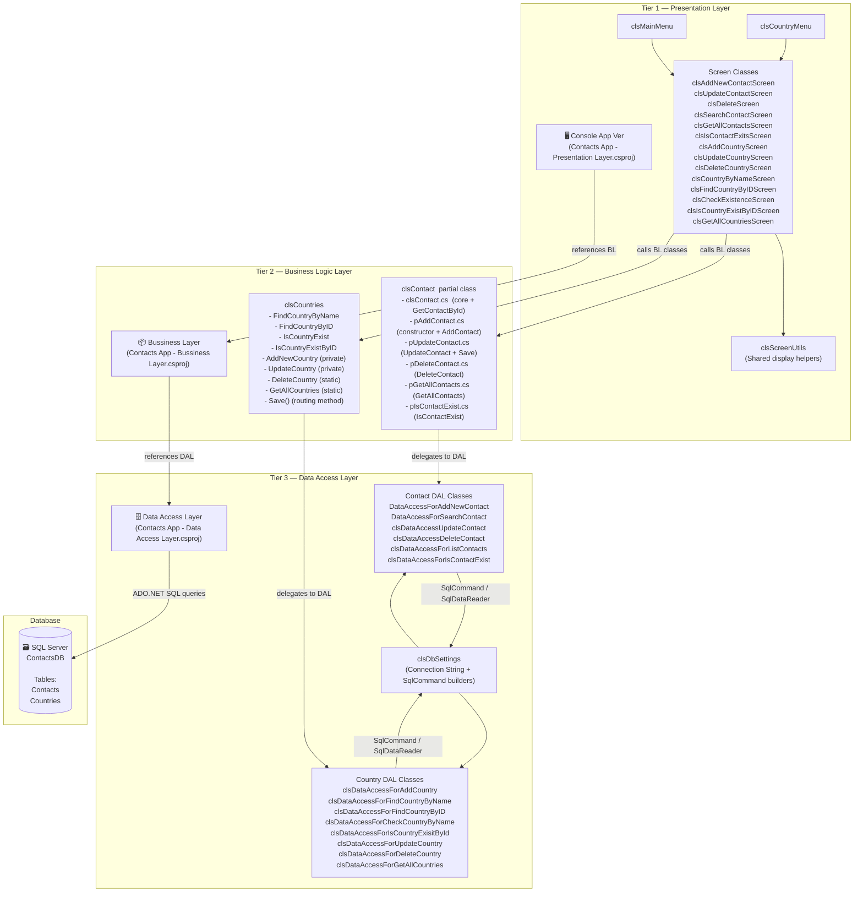

# Contacts App — Comprehensive Project Documentation


https://github.com/user-attachments/assets/8d243887-2635-46d1-a73b-dd626562b8bb


-------------------------------------

## Table of Contents

1. [Project Overview](#1-project-overview)
2. [Technology Stack](#2-technology-stack)
3. [Three-Tier Architecture](#3-three-tier-architecture)
   - 3.1 [Architecture Diagram](#31-architecture-diagram)
   - 3.2 [Layer Responsibilities](#32-layer-responsibilities)
   - 3.3 [Dependency Flow](#33-dependency-flow)
4. [Project Structure & File Organization](#4-project-structure--file-organization)
   - 4.1 [Presentation Layer](#41-presentation-layer-console-app-ver)
   - 4.2 [Business Logic Layer](#42-business-logic-layer-bussiness-layer)
   - 4.3 [Data Access Layer](#43-data-access-layer-data-access-layer)
5. [Features](#5-features)
   - 5.1 [Contact Management Features](#51-contact-management-features)
   - 5.2 [Country Management Features](#52-country-management-features)
6. [Class Reference](#6-class-reference)
   - 6.1 [Business Logic Classes](#61-business-logic-classes)
   - 6.2 [Data Access Classes](#62-data-access-classes)
   - 6.3 [Presentation Classes](#63-presentation-classes)
7. [Validation & Business Rules](#7-validation--business-rules)
   - 7.1 [Business Layer Validations](#71-business-layer-validations)
   - 7.2 [Data Access Layer Validations](#72-data-access-layer-validations)
   - 7.3 [Presentation Layer Input Handling](#73-presentation-layer-input-handling)
8. [Database Design](#8-database-design)
9. [Key Design Patterns & Decisions](#9-key-design-patterns--decisions)
10. [Data Flow Walkthroughs](#10-data-flow-walkthroughs)
    - 10.1 [Adding a New Contact](#101-adding-a-new-contact)
    - 10.2 [Updating an Existing Contact](#102-updating-an-existing-contact)
    - 10.3 [Adding a New Country (Duplicate Prevention)](#103-adding-a-new-country-duplicate-prevention)

---

## 1. Project Overview

The **Contacts App** is a C# console application designed to manage a contact book backed by a **SQL Server** database. It allows users to create, read, update, and delete (CRUD) both **Contacts** and **Countries**.

The application is architecturally split into **three separate C# class library projects**, each representing one tier of the classic **3-Tier Architecture** pattern:

| Project | Role |
|---|---|
| `Contacts App - Console App Ver` | Presentation Layer (UI) |
| `Contacts App - Bussiness Layer` | Business Logic Layer |
| `Contacts App - Data Access Layer` | Data Access Layer |

The three projects are assembled into a single Visual Studio solution (`Contacts App - Console App Ver.slnx`).

---

## 2. Technology Stack

| Component | Technology |
|---|---|
| **Language** | C# (.NET) |
| **Application Type** | Console Application |
| **Database** | Microsoft SQL Server (`ContactsDB`) |
| **Data Access** | ADO.NET (`Microsoft.Data.SqlClient`) |
| **ORM** | None — raw parameterized SQL queries |
| **IDE** | Visual Studio |
| **Architecture Pattern** | 3-Tier Architecture |

---

## 3. Three-Tier Architecture

### 3.1 Architecture Diagram



> [!NOTE]
> **Strict one-way dependency rule**: The Presentation Layer only knows about the Business Logic Layer. The Business Logic Layer only knows about the Data Access Layer. The DAL knows only about the database. No layer references a layer above it.

---

### 3.2 Layer Responsibilities

#### Tier 1 — Presentation Layer
- Renders menus and screen prompts to the console.
- Reads user input from `Console.ReadLine()` and `Console.ReadKey()`.
- Performs basic input parsing (e.g., `int.TryParse`, `DateTime.Parse`).
- Calls Business Logic Layer classes to execute operations.
- Displays success/failure feedback to the user.
- Contains **zero business logic** and **zero SQL queries**.

#### Tier 2 — Business Logic Layer
- Encapsulates the domain objects: `clsContact` and `clsCountries`.
- Implements the **mode-switching pattern** (`enMode.Add` / `enMode.Update`) via a `Save()` method that routes to the correct add or update operation.
- Enforces business-level validations (null checks, data guard clauses) before delegating to the DAL.
- Returns typed objects (e.g., `clsContact?`, `clsCountries?`) rather than raw database results.
- **Factory-style instantiation**: The private parameterized constructor of `clsContact` and `clsCountries` ensures that fully-populated objects can only be created from database data (via static Find methods), while public constructors are reserved for new-record creation.

#### Tier 3 — Data Access Layer
- Contains **one class per database operation** — a fine-grained, single-responsibility design.
- All classes are `static`, meaning they hold no instance state; they simply execute a SQL query and return a result.
- Uses **parameterized queries exclusively** (via `SqlCommand.Parameters.AddWithValue`) to prevent SQL injection.
- Uses `try/catch/finally` blocks uniformly to ensure the database connection is always closed, even on exceptions.
- The `clsDbSettings` class centralizes the connection string and provides shared `SqlCommand` builder overloads for Contact-related operations.

---

### 3.3 Dependency Flow

```
User Input
    │
    ▼
[Presentation Layer]  ──► User sees console output
    │  calls BL methods
    ▼
[Business Logic Layer]  ──► Validates, orchestrates, returns domain objects
    │  calls DAL methods
    ▼
[Data Access Layer]  ──► Executes parameterized SQL
    │  via ADO.NET
    ▼
[SQL Server — ContactsDB]  ──► Persists / retrieves data
```

---

## 4. Project Structure & File Organization

### 4.1 Presentation Layer (`Console App Ver`)

```
Contacts App - Console App Ver/
│
├── Contacts App - Console App Ver.slnx       ← Solution file
├── Contacts App - Presentation Layer.csproj  ← Project file (references BL)
├── Program.cs                                ← Entry point; calls clsMainMenu.ShowMainScreen()
│
├── clsMainMenu.cs           ← Main navigation menu (7 Contact options + exit)
├── clsCountryMenu.cs        ← Country sub-menu (8 Country options + back)
├── clsScreenUtils.cs        ← Shared utilities: PrintMenuOption(), DisplayContactInfo()
│
│   ── Contact Screens ──
├── clsSearchContactScreen.cs         ← Find contact by ID → display info
├── clsAddNewContactScreen.cs         ← Collect fields → clsContact.Save()
├── clsUpdateContactScreen.cs         ← Load contact → edit fields → clsContact.Save()
├── clsDeleteScreen.cs                ← Input ID → clsContact.DeleteContact()
├── clsGetAllContactsScreen.cs        ← Tabular list of all contacts
├── clsIsContactExitsScreen.cs        ← Check if contact exists by ID
├── clsCheckExistenceScreen'.cs       ← Check if country exists by name
│
│   ── Country Screens ──
├── clsCountryByNameScreen.cs         ← Find country by name
├── clsFindCountryByIDScreen.cs       ← Find country by ID
├── clsAddCountryScreen.cs            ← Collect fields → clsCountries.Save()
├── clsUpdateCountryScreen.cs         ← Load country → edit fields → clsCountries.Save()
├── clsDeleteCountryScreen.cs         ← Input ID → clsCountries.DeleteCountry()
├── clsGetAllCountriesScreen.cs       ← Tabular list of all countries
├── clsIsCountryExistByIDScreen.cs    ← Check if country exists by ID
└── clsIsContactExitsScreen.cs        ← Check if contact exists by ID
```

### 4.2 Business Logic Layer (`Bussiness Layer`)

```
Contacts App - Bussiness Layer/
│
├── Contacts App - Bussiness Layer.csproj  ← Project file (references DAL)
│
│   ── Contact Domain (partial class split) ──
├── clsContact.cs          ← Core: properties, private constructor, GetContactById()
├── pAddContact.cs         ← partial clsContact: public constructor (Add mode) + AddContact()
├── pUpdateContact.cs      ← partial clsContact: UpdateContact() + Save() router
├── pDeleteContact.cs      ← partial clsContact: static DeleteContact(int ContactID)
├── pGetAllContacts.cs     ← partial clsContact: static GetAllContacts() → DataTable
└── pIsContactExist.cs     ← partial clsContact: static IsContactExist(int ContactID)

│   ── Country Domain ──
└── clsCountries.cs        ← Full class: all country CRUD, Save() router, Find methods
```

> [!IMPORTANT]
> `clsContact` is a **partial class** deliberately split across 6 files — one file per logical concern. This is a deliberate organizational choice to keep each file small and focused, while C# merges them into one class at compile time.

### 4.3 Data Access Layer (`Data Access Layer`)

```
Contacts App - Data Access Layer/
│
├── Contacts App - Data Access Layer.csproj  ← Project file (references Microsoft.Data.SqlClient)
│
│   ── Infrastructure ──
├── clsDbSettings.cs    ← Connection string, shared SqlConnection, Command builder overloads,
│                          CheckNumOfAffectedRows() helper
│
│   ── Contact DAL Classes (one class per operation) ──
├── DataAccessForAddNewContact.cs         ← INSERT into Contacts, returns new ContactID
├── DataAccessForSearchContact.cs         ← SELECT * from Contacts WHERE ContactID=@ID (by-ref params)
├── clsDataAccessUpdateContact.cs         ← UPDATE Contacts WHERE ContactID=@ID
├── clsDataAccessDeleteContact.cs         ← DELETE from Contacts WHERE ContactID=@ID
├── clsDataAccessForListContacts.cs       ← SELECT with JOIN on Countries, returns DataTable
└── clsDataAccessForIsContactExist.cs     ← SELECT x='T' → scalar bool check
│
│   ── Country DAL Classes (one class per operation) ──
├── clsDataAccessForAddCountry.cs         ← INSERT into Countries + duplicate guard
├── clsDataAccessForFindCountryByName.cs  ← SELECT * WHERE LOWER(CountryName)=LOWER(@Name)
├── clsDataAccessForFindCountryByID.cs    ← SELECT * WHERE CountryID=@ID
├── clsDataAccessForCheckCountryByName.cs ← SELECT R='T' scalar bool check by name
├── clsDataAccessForIsCountryExisitById.cs← SELECT R='T' scalar bool check by ID
├── clsDataAccessForUpdateCountry.cs      ← UPDATE Countries WHERE CountryID=@ID
├── clsDataAccessForDeleteCountry.cs      ← DELETE from Countries WHERE CountryID=@ID
└── clsDataAccessForGetAllCountries.cs    ← SELECT * FROM Countries ORDER BY CountryID ASC → DataTable
```

---

## 5. Features

### 5.1 Contact Management Features

| # | Feature | Description |
|---|---|---|
| 1 | **Search Contact by ID** | Retrieves a single contact record by its primary key and displays all fields in a formatted box. |
| 2 | **Add New Contact** | Collects all contact fields from the user and inserts a new record. The new ContactID is returned and displayed. First name and last name are stored in lowercase via SQL `LOWER()`. |
| 3 | **Update Contact** | Loads an existing contact by ID, allows all fields to be edited, then saves changes. The object's mode automatically switches to `Update`. |
| 4 | **Delete Contact** | Removes a contact record from the database by ContactID. Displays success or failure. |
| 5 | **List All Contacts** | Displays all contacts in a formatted table with columns: FirstName, LastName, Email, Phone, Address, DateOfBirth, CountryName. Uses a JOIN with the Countries table to resolve the country name. |
| 6 | **Check Contact Existence** | Returns a boolean result for whether a contact with a given ID exists in the database. |

### 5.2 Country Management Features

| # | Feature | Description |
|---|---|---|
| 1 | **Find Country by Name** | Case-insensitive lookup of a country by its name. Returns CountryID, Code, and PhoneCode. |
| 2 | **Check Country Existence (by Name)** | Returns a boolean indicating whether a country name exists. Comparison is case-insensitive. |
| 3 | **Find Country by ID** | Retrieves a country record by its primary key, returning all fields. |
| 4 | **Check Country Existence (by ID)** | Returns a boolean indicating whether a country with a given ID exists. |
| 5 | **Add New Country** | Inserts a new country (Name, Code, PhoneCode). Country code is stored in uppercase via SQL `UPPER()`. **Prevents duplicate country names** at the DAL level. |
| 6 | **Update Country** | Loads an existing country by ID, allows fields to be edited, then saves changes via the `Save()` router. |
| 7 | **List All Countries** | Displays all country records ordered by CountryID in a formatted tabular layout. |
| 8 | **Delete Country** | Removes a country record from the database by CountryID. |

---

## 6. Class Reference

### 6.1 Business Logic Classes

#### `clsContact` (partial class — 6 files)

| Member | Kind | Description |
|---|---|---|
| `ContactID` | `int` (get only) | Primary key — set only via private constructor (from DB) or after a successful `Save()`. |
| `FirstName` | `string` | Contact's first name. |
| `LastName` | `string` | Contact's last name. |
| `Email` | `string` | Contact's email address. |
| `Phone` | `string` | Contact's phone number. |
| `Address` | `string` | Contact's home/work address. |
| `DateOfBirth` | `DateTime` | Date of birth. |
| `CountryID` | `int` | Foreign key reference to `Countries.CountryID`. |
| `ImagePath` | `string` | Optional file path to a profile image. |
| `enMode` | `enum` (private) | `Add=2`, `Update=1`, `Remove=3` — controls behavior of `Save()`. |
| `clsContact(id, ...)` | Private constructor | Populates all fields; sets mode to `Update`. Called only by `GetContactById()`. |
| `clsContact(firstName, ...)` | Public constructor | Populates all fields except ID; sets mode to `Add`. Used to create new contacts. |
| `GetContactById(int)` | `static clsContact?` | Factory method — retrieves from DB, returns `null` if not found. |
| `AddContact()` | `private bool` | Delegates to `DataAccessForAddNewContact`; sets `ContactID` from returned identity. |
| `UpdateContact()` | `private bool` | Delegates to `clsDataAccessUpdateContact`. |
| `Save()` | `public bool` | Routes to `AddContact()` or `UpdateContact()` based on `_Mode`. After a successful add, resets mode to `Update`. |
| `DeleteContact(int)` | `static bool` | Delegates to `clsDataAccessDeleteContact`. |
| `GetAllContacts()` | `static DataTable` | Delegates to `clsDataAccessForListContacts`. |
| `IsContactExist(int)` | `static bool` | Delegates to `clsDataAccessForIsContactExist`. |

---

#### `clsCountries`

| Member | Kind | Description |
|---|---|---|
| `CountryID` | `int` (get only) | Primary key — set only via private constructor. |
| `CountryName` | `string` | Name of the country. |
| `Code` | `string` | ISO country code (e.g., "EG", "US"). Stored uppercase in DB. |
| `PhoneCode` | `string` | International dialing prefix (e.g., "+20"). |
| `enMode` | `enum` (private) | `update=1`, `add=2` — controls `Save()` routing. |
| `clsCountries(id, name, code, phone)` | Private constructor | Populates all fields; mode = `update`. Used by Find methods. |
| `clsCountries(name, code, phone)` | Public constructor | Populates fields except ID; mode = `add`. Used for new country creation. |
| `FindCountryByName(string)` | `static clsCountries?` | Trims input, delegates to DAL; returns `null` if not found. |
| `FindCountryByID(int)` | `static clsCountries?` | Validates integer, delegates to DAL; returns `null` if not found. |
| `IsCountryExist(string?)` | `static bool` | Null-guard then delegates to `clsDataAccessForCheckCountryByName`. |
| `IsCountryExistByID(int)` | `static bool` | Validates integer then delegates to `clsDataAccessForIsCountryExisitById`. |
| `AddNewCountry()` | `private bool` | Returns `true` if new ID ≠ -1. |
| `UpdateCountry()` | `private bool` | Delegates to `clsDataAccessForUpdateCountry`. |
| `Save()` | `public bool` | Routes to add or update based on `_mode`. Resets mode to `update` after a successful add. |
| `DeleteCountry(int)` | `static bool` | Validates integer then delegates to `clsDataAccessForDeleteCountry`. |
| `GetAllCountries()` | `static DataTable` | Delegates to `clsDataAccessForGetAllCountries`. |

---

### 6.2 Data Access Classes

All DAL classes are `static`. Each encapsulates a private `Query()` method that returns the SQL string, keeping the query definition separate from execution logic.

#### Contact DAL

| Class | Method | SQL Operation |
|---|---|---|
| `DataAccessForAddNewContact` | `AddNewContactToDB(...)` → `int` | `INSERT INTO Contacts ... SELECT SCOPE_IDENTITY()` — returns new ID or -1 |
| `DataAccessForSearchContact` | `CheckContactOnDb(ref params)` → `bool` | `SELECT * FROM Contacts WHERE ContactID=@ID` — populates all ref params |
| `clsDataAccessUpdateContact` | `UpdateContactInDb(...)` → `bool` | `UPDATE Contacts SET ... WHERE ContactID=@ID` |
| `clsDataAccessDeleteContact` | `DeleteContactFromDb(int)` → `bool` | `DELETE FROM Contacts WHERE ContactID=@ID` |
| `clsDataAccessForListContacts` | `GetAllContactsFromDbInDT()` → `DataTable` | `SELECT ... FROM Contacts INNER JOIN Countries ON ...` |
| `clsDataAccessForIsContactExist` | `IsContactExist(int)` → `bool` | `SELECT x='T' FROM Contacts WHERE ContactID=@ID` — scalar check |

#### Country DAL

| Class | Method | SQL Operation |
|---|---|---|
| `clsDataAccessForAddCountry` | `AddNewCountryToDb(...)` → `int` | `INSERT INTO Countries ... SELECT SCOPE_IDENTITY()` — duplicate guard via `IsCountryAlreadyExist` |
| `clsDataAccessForFindCountryByName` | `FindCountryByName(string, ref params)` → `bool` | `SELECT * WHERE LOWER(CountryName)=LOWER(@Name)` |
| `clsDataAccessForFindCountryByID` | `FindCountryByID(int, ref params)` → `bool` | `SELECT * WHERE CountryID=@ID` — handles `DBNull` for Code, PhoneCode, CountryName |
| `clsDataAccessForCheckCountryByName` | `IsCountryExisitByName(string?)` → `bool` | `SELECT R='T' WHERE LOWER(CountryName)=LOWER(@Name)` |
| `clsDataAccessForIsCountryExisitById` | `IsCountryExistByID(int)` → `bool` | `SELECT R='T' WHERE CountryID=@ID` |
| `clsDataAccessForUpdateCountry` | `UpdateCountryOnDb(...)` → `bool` | `UPDATE Countries SET ... WHERE CountryID=@ID` |
| `clsDataAccessForDeleteCountry` | `DeleteCountryFromDb(int)` → `bool` | `DELETE Countries WHERE CountryID=@ID` |
| `clsDataAccessForGetAllCountries` | `GetAllCountries()` → `DataTable` | `SELECT * FROM Countries ORDER BY CountryID ASC` |

#### Infrastructure

| Class | Member | Purpose |
|---|---|---|
| `clsDbSettings` | `ConnectionString` (private `string`) | Hardcoded SQL Server connection string (`Server=OSAMA-PC;Database=ContactsDB;Integrated Security=True;TrustServerCertificate=True`) |
| `clsDbSettings` | `DbConnection` (`SqlConnection`) | Single shared `SqlConnection` instance used across all DAL classes |
| `clsDbSettings` | `CheckNumOfAffectedRows(int)` | Returns `true` if rows affected > 0 — uniform success check for non-query operations |
| `clsDbSettings` | `Command(query, contact fields...)` | Overloaded `SqlCommand` builder — one for INSERT (no ID), one for UPDATE (with ID) |

---

### 6.3 Presentation Classes

| Class | Purpose |
|---|---|
| `Program` | Entry point — calls `clsMainMenu.ShowMainScreen()` |
| `clsMainMenu` | Top-level menu loop; routes to 7 contact/country operations |
| `clsCountryMenu` | Country sub-menu loop; routes to 8 country operations |
| `clsScreenUtils` | Shared helpers: `PrintMenuOption()`, `DisplayContactInfo()` (boxed output) |
| `clsSearchContactScreen` | Validates int ID input via `int.TryParse` loop, displays found contact |
| `clsAddNewContactScreen` | Collects all contact fields; catches `DateTime.Parse` failures |
| `clsUpdateContactScreen` | Loads contact by ID, fills updated fields, calls `Save()` |
| `clsDeleteScreen` | Parses ID, calls `clsContact.DeleteContact()` |
| `clsGetAllContactsScreen` | Displays contacts in formatted table with helper `GetDateOnly()` |
| `clsIsContactExitsScreen` | Checks and displays bool result for contact existence |
| `clsCountryByNameScreen` | Finds and displays a country by name |
| `clsFindCountryByIDScreen` | Finds and displays a country by ID |
| `clsAddCountryScreen` | Collects country fields, calls `clsCountries.Save()` |
| `clsUpdateCountryScreen` | Loads country, collects updated fields, calls `Save()` |
| `clsDeleteCountryScreen` | Parses ID, calls `clsCountries.DeleteCountry()` |
| `clsGetAllCountriesScreen` | Displays all countries in a formatted table |
| `clsCheckExistenceScreen'` | Checks country existence by name |
| `clsIsCountryExistByIDScreen` | Checks country existence by ID |

---

## 7. Validation & Business Rules

### 7.1 Business Layer Validations

These validations are implemented inside `clsContact` and `clsCountries` and execute **before** any DAL call.

#### `clsContact`

| Validation Point | Location | Rule |
|---|---|---|
| **Null check on `ContactId` integer** | `GetContactById` | Passes raw int to DAL; DAL returns `null` → method returns `null` if no record found |
| **Mode-guarded `Save()`** | `pUpdateContact.cs` | `Save()` will only route to `AddContact` or `UpdateContact` — it cannot accidentally do the wrong operation |
| **ContactID read-only** | Property declaration | `ContactID { get; private set; }` — cannot be externally assigned; set only through internal logic |
| **Mode reset after Add** | `pUpdateContact.cs` | After a successful `AddContact()`, `_Mode` is reset to `enMode.Update` so calling `Save()` again would update, not double-insert |

#### `clsCountries`

| Validation Point | Location | Rule |
|---|---|---|
| **Null country name check** | `FindCountryByName` | If `CountryName == null`, returns `null` immediately |
| **Name trimming** | `FindCountryByName` | `CountryName = CountryName.Trim()` before passing to DAL |
| **Null existence check** | `IsCountryExist` | If `CountryName == null`, returns `false` immediately |
| **Integer validation** | `FindCountryByID`, `IsCountryExistByID`, `DeleteCountry` | Uses `int.TryParse(CountryID.ToString(), out _)` — guards against overflow or invalid int cast |
| **CountryID read-only** | Property declaration | `CountryID { get; private set; }` |
| **Mode reset after Add** | `Save()` in `clsCountries.cs` | `_mode = enMode.update` after a successful add |
| **Duplicate country prevention** | `clsDataAccessForAddCountry` (DAL boundary) | Before inserting, calls `IsCountryAlreadyExist()` — returns `-1` immediately if country name already in DB |

---

### 7.2 Data Access Layer Validations

These validations happen at the DAL level, providing a second defensive layer.

| Validation | Class | Rule |
|---|---|---|
| **Null/parse check on SCOPE_IDENTITY** | `DataAccessForAddNewContact`, `clsDataAccessForAddCountry` | Uses `Result != null && int.TryParse(Result.ToString(), out int id)` before accepting the new ID |
| **DBNull handling for ImagePath** | `clsDbSettings.Command()` | Checks `ImagePath != null || ImagePath != string.Empty` — passes `DBNull.Value` to DB if absent |
| **DBNull handling for country fields** | `clsDataAccessForFindCountryByID`, `clsDataAccessForFindCountryByName` | Each nullable field (`Code`, `PhoneCode`, `CountryName`) individually checked against `DBNull.Value` before casting |
| **DBNull handling for ImagePath (read)** | `DataAccessForSearchContact` | `if(Reader["ImagePath"] != DBNull.Value)` before casting to `string` |
| **Boolean scalar check pattern** | `clsDataAccessForIsContactExist`, `clsDataAccessForIsCountryExisitById`, `clsDataAccessForCheckCountryByName` | Executes `SELECT x='T' ...` — checks `result != null && result.ToString() == "T"` |
| **Rows affected check** | `clsDbSettings.CheckNumOfAffectedRows(int)` | Returns `(NumOfAffectedRows > 0)` — centralized success check for all write operations |
| **Exception containment** | All DAL classes | All DB operations wrapped in `try/catch/finally`. Exceptions are caught silently and the method returns a failure state (`false`, `-1`, empty `DataTable`) |
| **Connection always closed** | All DAL classes | `finally { clsDbSettings.DbConnection.Close(); }` — guaranteed even on exception |
| **Duplicate country guard** | `clsDataAccessForAddCountry` | Before INSERT, calls `clsDataAccessForCheckCountryByName.IsCountryExisitByName()` — if `true`, returns `-1` without inserting |
| **Case-insensitive name matching** | `clsDataAccessForCheckCountryByName`, `clsDataAccessForFindCountryByName` | SQL uses `LOWER(CountryName) = LOWER(@CountryName)` for case-insensitive comparison |

---

### 7.3 Presentation Layer Input Handling

| Screen | Input | Handling |
|---|---|---|
| `clsSearchContactScreen` | Contact ID (int) | `while (!int.TryParse(Console.ReadLine(), out ID))` — loops until valid integer entered |
| `clsAddNewContactScreen` | Date of Birth | `try { DateOfBirth = DateTime.Parse(...); } catch { DateOfBirth = default; }` — catches parse errors with fallback |
| `clsAddNewContactScreen` | Country ID | `Convert.ToInt32(Console.ReadLine())` — throws if non-integer (not yet guarded) |
| `clsMainMenu` | Menu option | `try { Option = Convert.ToInt32(...); } catch { Option = -2; }` — invalid input sets option to -2 (out of range, loop repeats) |
| `clsCountryMenu` | Menu option | Same pattern as `clsMainMenu` |
| `clsDeleteScreen` | Contact ID | `int.TryParse(Console.ReadLine(), out int ContactID)` — defaults to 0 on failure |
| `clsUpdateContactScreen` | Contact ID | `Convert.ToInt32(Console.ReadLine())` — not yet guarded |

> [!WARNING]
> Some numeric input fields (e.g., CountryID in the Add/Update screens) use `Convert.ToInt32()` without a `try/catch` guard, which can throw a `FormatException` if the user enters non-numeric text. These are candidates for improvement with `int.TryParse`.

---

## 8. Database Design

The application operates on a `ContactsDB` database with two tables:

### `Contacts` Table

| Column | Type | Notes |
|---|---|---|
| `ContactID` | `int` | Primary Key, Identity |
| `FirstName` | `nvarchar` / `varchar` | Stored as lowercase via `LOWER()` in INSERT query |
| `LastName` | `nvarchar` / `varchar` | Stored as lowercase via `LOWER()` in INSERT query |
| `Email` | `nvarchar` / `varchar` | |
| `Phone` | `nvarchar` / `varchar` | |
| `Address` | `nvarchar` / `varchar` | |
| `DateOfBirth` | `datetime` | |
| `CountryID` | `int` | Foreign key → `Countries.CountryID` |
| `ImagePath` | `nvarchar` / `varchar` | Nullable — stored as `DBNull.Value` when not provided |

### `Countries` Table

| Column | Type | Notes |
|---|---|---|
| `CountryID` | `int` | Primary Key, Identity |
| `CountryName` | `nvarchar` / `varchar` | Unique in practice (enforced by BL/DAL duplicate guard) |
| `Code` | `nvarchar` / `varchar` | Stored as uppercase via `UPPER()` in INSERT query; nullable |
| `PhoneCode` | `nvarchar` / `varchar` | Nullable |

### Entity Relationship

```
Countries (1) ──────< (many) Contacts
   CountryID ◄────── CountryID (FK)
```

The `GetAllContacts` listing query performs an **INNER JOIN** between `Contacts` and `Countries` to display the `CountryName` instead of just the raw `CountryID`.

---

## 9. Key Design Patterns & Decisions

### 1. Mode-Switching `Save()` Pattern
Both `clsContact` and `clsCountries` expose a single `Save()` method that internally routes to either an add or update operation based on an `enMode` enum field. This gives the presentation layer a uniform, simple interface: just call `Save()` regardless of whether the object is new or existing.

```csharp
// New contact → mode = Add
clsContact contact = new clsContact(firstName, ...);
contact.Save(); // internally calls AddContact()

// Existing contact → mode = Update (set by private constructor from DB)
clsContact contact = clsContact.GetContactById(id);
contact.FirstName = "NewName";
contact.Save(); // internally calls UpdateContact()
```

### 2. Private Constructor Factory Pattern
`GetContactById()` and the `Find*` methods act as **factory methods**. They are the only way to obtain a fully-populated domain object (with a valid ID). The private constructor prevents external code from manually constructing an object that pretends to be a database record.

### 3. Partial Class Decomposition of `clsContact`
The contact class is split into 6 partial class files, each covering one feature (Add, Update, Delete, GetAll, IsExist, core). This keeps each file focused and short while remaining a single C# class at compile time.

### 4. One DAL Class Per Operation
Rather than one large repository class with many methods, each database operation has its own dedicated static class. This enforces a strict **Single Responsibility Principle** at the file level and makes the codebase easy to navigate.

### 5. Centralized Connection Management via `clsDbSettings`
The `clsDbSettings.DbConnection` is a single shared `SqlConnection`. All DAL classes open and close this connection per operation inside `try/finally` blocks, making connection management predictable and safe.

### 6. Scalar "T" Check Pattern for Existence Queries
Instead of fetching full rows to check existence, the app uses a lightweight pattern:
```sql
SELECT x = 'T' FROM Contacts WHERE ContactID = @ContactID
```
`ExecuteScalar()` returns `"T"` if a row is found, `null` otherwise — a minimal round-trip check.

### 7. `SCOPE_IDENTITY()` for New Record IDs
After every INSERT, the query immediately fetches `SCOPE_IDENTITY()` in the same batch to retrieve the newly assigned primary key. This is returned as the new object's ID.

---

## 10. Data Flow Walkthroughs

### 10.1 Adding a New Contact

```
User (console input)
  │  Types: FirstName, LastName, Email, Phone, Address, DOB, CountryID, ImagePath
  ▼
clsAddNewContactScreen.ShowAddContactScreen()
  │  Creates: new clsContact(firstName, ...) → _Mode = enMode.Add
  │  Calls:   Contact.Save()
  ▼
clsContact.Save()  [pUpdateContact.cs]
  │  case enMode.Add → calls AddContact()
  ▼
clsContact.AddContact()  [pAddContact.cs]
  │  Calls: DataAccessForAddNewContact.AddNewContactToDB(...)
  ▼
DataAccessForAddNewContact.AddNewContactToDB()
  │  Opens DbConnection
  │  Executes: INSERT INTO Contacts(...) VALUES(...); SELECT SCOPE_IDENTITY()
  │  Gets new ContactID from SCOPE_IDENTITY()
  │  Closes DbConnection
  │  Returns: ContactID (or -1 on failure)
  ▼
clsContact.AddContact()
  │  Sets this.ContactID = returned ID
  │  Returns: true if ID ≠ -1
  ▼
clsContact.Save()
  │  Resets _Mode = enMode.Update
  │  Returns: true
  ▼
clsAddNewContactScreen
  └──► Displays: "Contact With ID {X} Has Been Inserted!"
```

---

### 10.2 Updating an Existing Contact

```
User types Contact ID
  ▼
clsUpdateContactScreen.ShowUpdateScreen()
  │  Calls: clsContact.GetContactById(ContactId)
  ▼
clsContact.GetContactById()  [clsContact.cs]
  │  Calls: DataAccessForSearchContact.CheckContactOnDb(ref params)
  ▼
DataAccessForSearchContact.CheckContactOnDb()
  │  Executes: SELECT * FROM Contacts WHERE ContactID = @ID
  │  Populates: ref FirstName, LastName, Email, Phone, Address, DOB, CountryID, ImagePath
  │  Returns: true if record found
  ▼
clsContact.GetContactById()
  │  If found: returns new clsContact(id, ...) with _Mode = enMode.Update
  │  If not found: returns null
  ▼
clsUpdateContactScreen
  │  If null → displays failure message
  │  If found → calls FillToUpdateContactInfo(ref contact) [user types new values]
  │  Calls: contact.Save()
  ▼
clsContact.Save()
  │  case enMode.Update → calls UpdateContact()
  ▼
clsContact.UpdateContact()
  │  Calls: clsDataAccessUpdateContact.UpdateContactInDb(ContactID, ...)
  ▼
clsDataAccessUpdateContact.UpdateContactInDb()
  │  Executes: UPDATE Contacts SET ... WHERE ContactID = @ID
  │  Returns: true if rows affected > 0
  ▼
clsUpdateContactScreen
  └──► Displays: "Updated Successfully!" or "Failed To Update"
```

---

### 10.3 Adding a New Country (Duplicate Prevention)

```
User types CountryName, Code, PhoneCode
  ▼
clsAddCountryScreen.ShowAddCountryScreen()
  │  Creates: new clsCountries(name, code, phoneCode) → _mode = enMode.add
  │  Calls:   country.Save()
  ▼
clsCountries.Save()
  │  case enMode.add → calls AddNewCountry()
  ▼
clsCountries.AddNewCountry()
  │  Calls: clsDataAccessForAddCountry.AddNewCountryToDb(name, code, phoneCode)
  ▼
clsDataAccessForAddCountry.AddNewCountryToDb()
  │  ① Calls: IsCountryAlreadyExist(CountryName)
  │        → clsDataAccessForCheckCountryByName.IsCountryExisitByName(name)
  │        → SELECT R='T' WHERE LOWER(CountryName)=LOWER(@Name)
  │  ② If exists → returns -1 immediately (no INSERT)
  │  ③ If not exists → Opens DbConnection
  │       Executes: INSERT INTO Countries(...) VALUES(...); SELECT SCOPE_IDENTITY()
  │       Returns: new CountryID
  ▼
clsCountries.AddNewCountry()
  │  Returns: true if ID ≠ -1
  ▼
clsCountries.Save()
  │  Resets _mode = enMode.update
  │  Returns: true
  ▼
clsAddCountryScreen
  └──► Displays: "The New Country Has Been Inserted Successfully!" or "Failed To Insert!"
```

---

*Documentation generated on 2026-08-15 | Contacts App — ADO.NET 3-Tier Architecture Project*
